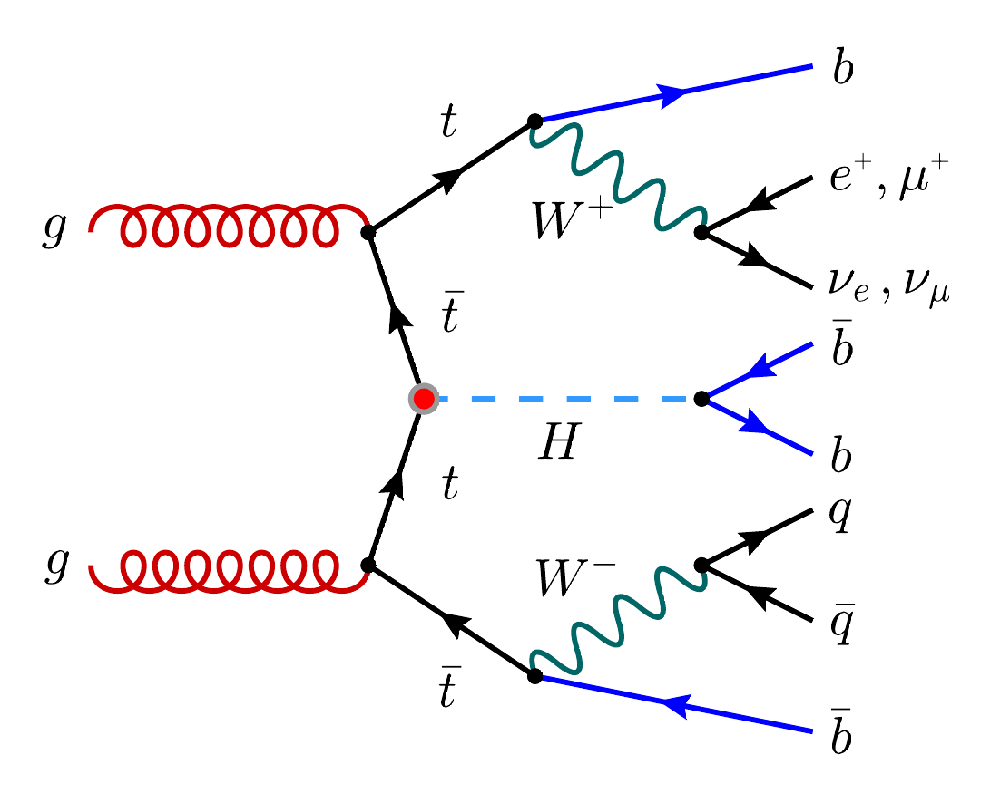

# Tutorial: Regression with PyTorch in High Energy Physics

This repository contains a walk-through example of how to implement a simple regression model using PyTorch in High Energy Physics (HEP). For this example, we will use the $t\bar{t}H$ process as a case study, and aim to predict the transverse momentum spectrum of the Higgs boson. We will focus on the semi-leptonic decay mode of the $t\bar{t}$ system, where one of the $W$-bosons decays leptonically and the other hadronically. The decay mode of the Higgs boson under consideration is $H \to b\bar{b}$, with a branching ratio of $\sim 58\%$.

- [Tutorial: Regression with PyTorch in High Energy Physics](#tutorial-regression-with-pytorch-in-high-energy-physics)
  - [Pre-requisites and Environment Setup](#pre-requisites-and-environment-setup)
  - [Resources](#resources)

A simple, exemplary, Feynman diagram of the process under consideration is shown below.

<div style="text-align: center">
  
</div>

## Pre-requisites and Environment Setup
TODO: explain set up

```bash
python -m venv venv
source venv/bin/activate
```

```bash
pip install -r requirements.txt
```

- See [Theory](./tutorial/theory.md) for a brief overview of the theory behind the applied ML tutorial.

## Resources
Here is a list of amazing resources that I have found useful: